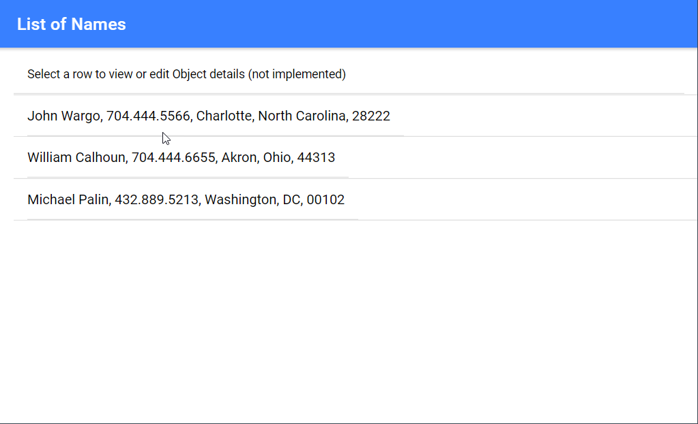

# Ionic Pipes Sample

> This solution solves the Pipe Not Found error I encountered when creating my own custom Pipe in Ionic.

While working on an Ionic project, I needed to create a custom Pipe that formatted my data in a certain way for presentation. In my case, it was an array of objects that I wanted to display in a view as a comma-separated list.

In looking around, I couldn't find a complete example (end to end) that showed how to do what I wanted. I followed a tutorial or two, each which took a different approach, and simply couldn't get it working. Every time I tried something, I would get an error in the browser console indicating that "the pipe 'PipeName' could not be found".

I finally asked on the Ionic Forums and got the solution I needed. I created this project to highlight the solution to help others in the same situation.

Create a project using the Ionic CLI:

```shell
ionic start ionic-pipes-example blank
```

Create a custom pipe using the following command:

```shell
ionic g pipe pipes/CommaObject
```

In this example, my pipe is called CommaObject and the Ionic CLI creates a file `comma-object.pipe.ts` in a new folder called pipes (`/app/pipes/comma-object.pipe.ts`).  The file looks like this:

```typescript
import { Pipe, PipeTransform } from '@angular/core';

@Pipe({
  name: 'commaObject'
})
export class CommaObjectPipe implements PipeTransform {

  transform(value: unknown, ...args: unknown[]): unknown {
    return null;
  }
}
```

To implement the pipe, all I need to do is replace the `return null;` line with my particular pipe's logic. In my case, its a simple map that returns all of the values for an object separated by commas:

```typescript
return Object.keys(value).map((k) => value[k]).join(', ');
```

So the complete `comma-object.pipe.ts` file looks like this:

```typescript
import { Pipe, PipeTransform } from '@angular/core';

@Pipe({
  name: 'commaObject'
})
export class CommaObjectPipe implements PipeTransform {

  transform(value: unknown, ...args: unknown[]): unknown {
    return Object.keys(value).map((k) => value[k]).join(', ');
  }
}
```

> When working on my own custom pipe, here's where I got confused.

When I created the pipe, the Ionic CLI automatically updated the project's `app.module.ts` file with my `CommaObjectPipe` component (as shown below). Unfortunately, the pipe won't work with the module loading there, this where I first started getting errors in the browser console.

```typescript
import { NgModule } from '@angular/core';
import { BrowserModule } from '@angular/platform-browser';
import { RouteReuseStrategy } from '@angular/router';

import { IonicModule, IonicRouteStrategy } from '@ionic/angular';

import { AppComponent } from './app.component';
import { AppRoutingModule } from './app-routing.module';
// HERE
import { CommaObjectPipe } from './pipes/comma-object.pipe';

@NgModule({
  // AND HERE
  declarations: [AppComponent, CommaObjectPipe],
  entryComponents: [],
  imports: [BrowserModule, IonicModule.forRoot(), AppRoutingModule],
  providers: [{ provide: RouteReuseStrategy, useClass: IonicRouteStrategy }],
  bootstrap: [AppComponent],
})
export class AppModule {}
```

Remove references to `CommaObjectPipe` in the project's `app.module.ts` as shown below:

```typescript
import { NgModule } from '@angular/core';
import { BrowserModule } from '@angular/platform-browser';
import { RouteReuseStrategy } from '@angular/router';

import { IonicModule, IonicRouteStrategy } from '@ionic/angular';

import { AppComponent } from './app.component';
import { AppRoutingModule } from './app-routing.module';

@NgModule({
  declarations: [AppComponent],
  entryComponents: [],
  imports: [BrowserModule, IonicModule.forRoot(), AppRoutingModule],
  providers: [{ provide: RouteReuseStrategy, useClass: IonicRouteStrategy }],
  bootstrap: [AppComponent],
})
export class AppModule {}
```

Where you must reference a custom pipe is in the `module` file for the Ionic page that uses the pipe. In this example project, there's only one page (`home`), so the next step is to open up the project's `app/home/home.module.ts` file and reference the custom pipe as highlighted below:

```typescript
import { NgModule } from '@angular/core';
import { CommonModule } from '@angular/common';
import { IonicModule } from '@ionic/angular';
import { FormsModule } from '@angular/forms';
import { HomePage } from './home.page';

import { HomePageRoutingModule } from './home-routing.module';

// HERE
import { CommaObjectPipe } from '../pipes/comma-object.pipe';

@NgModule({
  imports: [
    CommonModule,
    FormsModule,
    IonicModule,
    HomePageRoutingModule
  ],
  declarations: [
    HomePage,
    // HERE
    CommaObjectPipe
  ],
  // AND HERE
  exports: [CommaObjectPipe]
})
export class HomePageModule { }
```

With that in place, the custom pipe is available to the app's Home page.

In the project's `app/home/home.page.ts` file, I created a simple array of name objects as shown below:

```typescript
import { Component } from '@angular/core';

@Component({
  selector: 'app-home',
  templateUrl: 'home.page.html',
  styleUrls: ['home.page.scss'],
})
export class HomePage {

  private names: any[] = [{
    name: 'John Wargo',
    phone: '704.444.5566',
    city: 'Charlotte',
    state: 'North Carolina',
    zip: '28222'
  },
  {
    name: 'William Calhoun',
    phone: '704.444.6655',
    city: 'Akron',
    state: 'Ohio',
    zip: '44313'
  },
  {
    name: 'Michael Palin',
    phone: '432.889.5213',
    city: 'Washington',
    state: 'DC',
    zip: '00102'
  }];

  constructor() { }

}
```

And in the project's `app/home/home.page.html` file, I built a page that rendered the names array as a comma-separated list.

```HTML
<ion-header>
  <ion-toolbar color="primary">
    <ion-title>List of Names</ion-title>
  </ion-toolbar>
</ion-header>

<ion-content>
  <ion-list>
    <ion-item>
      <ion-list-header no-padding lines="full">
        {{ names?.length ? 'Select a row to view or edit Object details (not implemented)': 'No Object data to
        display' }}
      </ion-list-header>
    </ion-item>
    <ion-item *ngFor="let name of names">
      <ion-item>
        <ion-label>{{name | commaObject}}
        </ion-label>
      </ion-item>
    </ion-item>
  </ion-list>
</ion-content>
```

When you run the application, you should see something like this:



Another area of confusion for me was that many forum articles and tutorials referenced creating a Pipes module that referenced all of the custom pipes used in a project. The posts made it look like you had to reference custom pipes through this method, but that's not true as I've shown above. Creating a pipes module merely allows you to reference multiple custom pipes through inclusion of a single file in your page modules.

Let me show you an example. Based on an example I found on [StackOverflow](https://stackoverflow.com/questions/54711029/custom-pipe-not-found-ionic-4-pipe-not-found), I created a new file called `/app/pipe.module.ts` and populated it with the following code:

```typescript
import { NgModule } from '@angular/core';
import { CommaObjectPipe } from './pipes/comma-object.pipe';

@NgModule({
    declarations: [CommaObjectPipe],
    imports: [],
    exports: [CommaObjectPipe]
})

export class PipesModule { }
```

As you can see, this looks similar to what I did to my `home.module.ts` file earlier. Here's the same file, modified to use the `pipe.module.ts` file instead of referencing my custom pipe directly:

```typescript
import { NgModule } from '@angular/core';
import { CommonModule } from '@angular/common';
import { IonicModule } from '@ionic/angular';
import { FormsModule } from '@angular/forms';
import { HomePage } from './home.page';

import { HomePageRoutingModule } from './home-routing.module';

import { PipesModule } from '../pipe.module';

@NgModule({
  imports: [
    CommonModule,
    FormsModule,
    IonicModule,
    HomePageRoutingModule,
    // HERE
    PipesModule
  ],
  declarations: [HomePage]  
})
export class HomePageModule { }
```

What's different is that I don't have to change any `declarations` or `exports`, those are already handled by my `pipe.module.ts` file, it already declares then exports them for me.

So, if I add a second custom pipe to my project, such as one that reverses the order of characters in a string, I can add it to any pages that already use my `CommaObjectPipe` by simply added the new pipe to `pipe.module.ts`:

```typescript
import { NgModule } from '@angular/core';
import { CommaObjectPipe } from './pipes/comma-object.pipe';
import { ReversoPipe } from './pipes/reverso.pipe';

@NgModule({
    declarations: [CommaObjectPipe, ReversoPipe],
    imports: [],
    exports: [CommaObjectPipe, ReversoPipe]
})

export class PipesModule { }
```

That's it, that explained, for me anyway, why all the examples I found online referenced this separate pipe module file. 

***

You can find information on many different topics on my [personal blog](http://www.johnwargo.com). Learn about all of my publications at [John Wargo Books](http://www.johnwargobooks.com).

If you find this code useful and feel like thanking me for providing it, please consider <a href="https://www.buymeacoffee.com/johnwargo" target="_blank">Buying Me a Coffee</a>, or making a purchase from [my Amazon Wish List](https://amzn.com/w/1WI6AAUKPT5P9).
